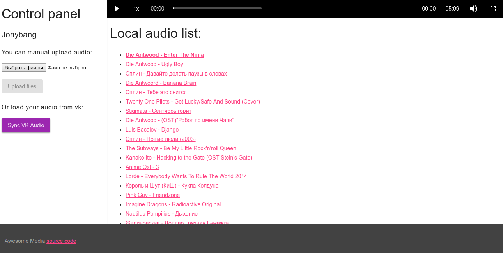

# Awesome Media App

Simple web audio player of server based media with possibility of sync with VKontakte.  
You can run this app on server, upload music and then listen from any place.


## Project stage

On current stage project you can upload music to app or load all available vkontakte audio to server ./public/media/user-id/ directory for play audio from your server.
Also you can share access to your app to vkontakte users by ids in config.js

## How to try

1. Prepare your server environment for MEAN stack (Node 6.* required):  
https://github.com/creationix/nvm  
https://docs.mongodb.com/manual/tutorial/install-mongodb-on-ubuntu/
2. Install ffmpeg: `sudo apt-get install ffmpeg`

3. Clone this repo to server: `git clone https://github.com/Jonybang/Awesome-Media`  

4. Execute npm run start on cloned directory `cd Awesome-Media && npm run start`

5. Open your-server-domain-or-ip:3007

6. Create first user and then upload music

## How to bind your app to domain or subdomain on server

<http://stackoverflow.com/questions/5009324/node-js-nginx-what-now>

## How to use Vkontakte integration

1. Create you own web-site VKontakte App: https://vk.com/editapp?act=create

2. Copy .env.example to .env: `cp .env.example .env`

3. Place your vk app secret to .env file.

4. Edit config.js vk_api_options and permissions.vkUsersIds

## Manual load VK audio:

Reason for manual load vk audio(RUS): http://vkaudiosaver.ru/news/otobrazhenie-ne-vseh-trekov-v-vkaudiosaver.html

```
var jq = document.createElement('script');
jq.src = "https://ajax.googleapis.com/ajax/libs/jquery/2.1.4/jquery.min.js";
document.getElementsByTagName('head')[0].appendChild(jq);
function sleep(ms) {ms += new Date().getTime();while (new Date() < ms){}} 
setTimeout(function(){
	$('.audio_row').length;
	
	var document_height = 0;
	var intervalID = setInterval(function(){
		if($(document).height() <= document_height)		
			scrollFinish();
					
		document_height = $(document).height();
		$(window).scrollTop($(document).height());
	}, 1000);
	
	function scrollFinish(){
	    clearInterval(intervalID);
	    // TODO: take ids from server and download not exist on server ids
	    console.log('scrollFinish');
	}
}, 1000);
```

Then manual upload audio to application

## TODO:

- Fix not first sync with vk
- Place "Manual load VK audio" script on app interface with instruction
- Cron for load audio
- Add remote sources(not only VK)

## Dev Notes

Mongoose:  
http://mongoosejs.com/docs/guide.html

NodeJS 6 DOCS:  
https://nodejs.org/dist/latest-v6.x/docs/api/

Node style guide:  
https://github.com/felixge/node-style-guide

Angular 2 ES6:  
https://github.com/blacksonic/angular2-esnext-todomvc

Angular Material:  
https://github.com/angular/material2

Player:  
https://github.com/videogular/videogular2

VK API:  
https://www.npmjs.com/package/vkapi  
or:  
https://github.com/57uff3r/nodejs-vksdk

Webpack styles:  
http://asyncee.github.io/blog/nastrojka-webpack-dlya-raboty-s-react-i-sass/

Socket with angular 2:  
https://github.com/jussikinnula/angular2-socketio-chat-example

FFProbe:  
https://github.com/ListenerApproved/node-ffprobe
